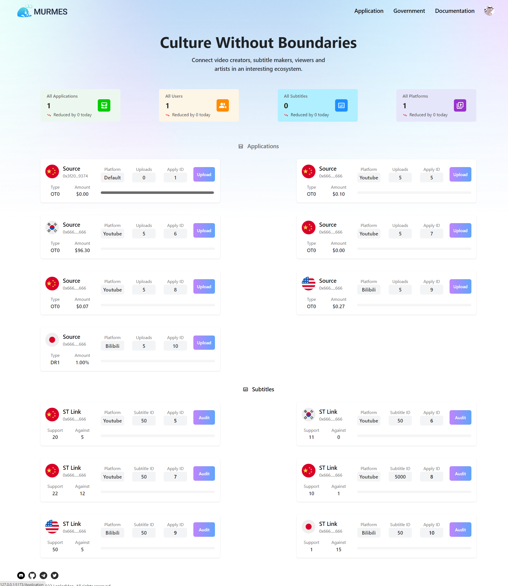
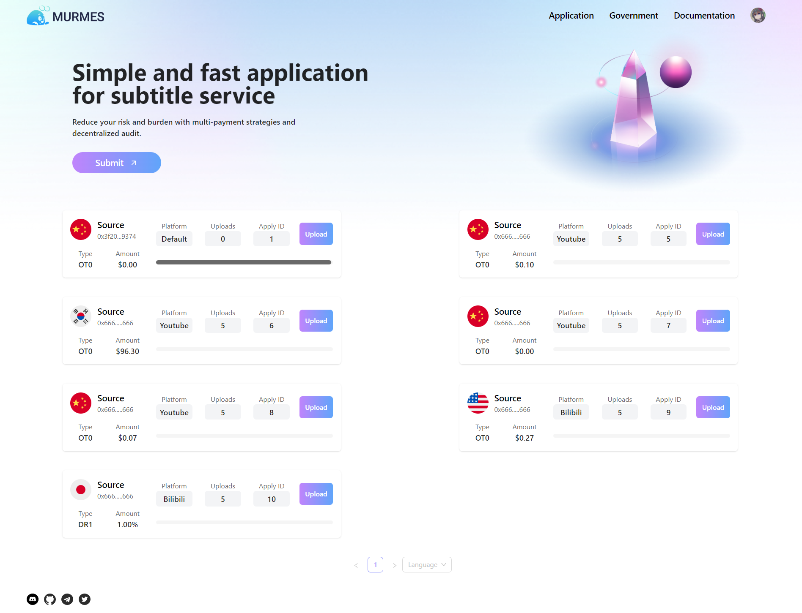
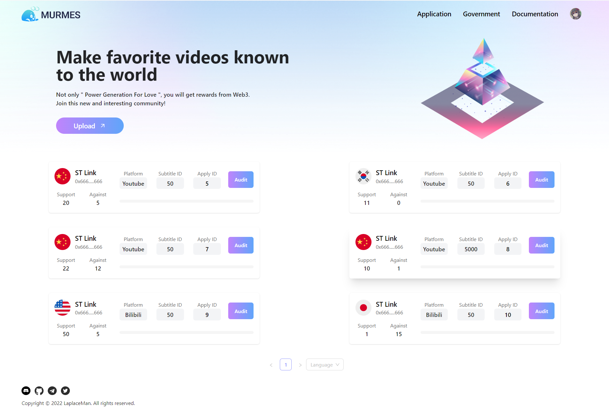
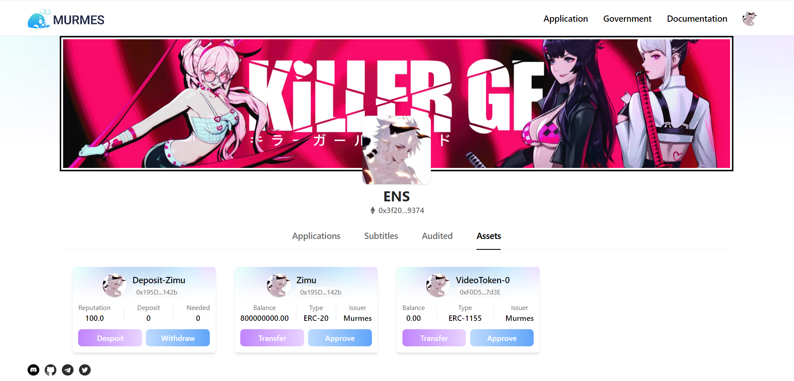

# Murmes Front-end Demo

[Murmes](https://github.com/LaplaceMan/tscs-contracts) is a blockchain-based tokenized subtitling crowdsourcing system. It is dedicated to solving the problem of "language silos" in the current video media platform. Through a complete set of trading mechanisms and economic models, video creators, subtitle makers, viewers, and investors are connected in an open, transparent, and multi-profit ecosystem.

This front-end implements the main functions in the Murmes protocol:

- Submit applications.
- Upload subtitles.
- Audit (evaluation) subtitles.
- Token transfer and authorization (Zimu and VT).
- Pledge and withdrawal (User join).
- Pre-settlement and settlement.

# Running locally

## Install Dependencies

`git clone https://github.com/LaplaceMan/tscs-react.git`

`npm install`

## Start-up

`npm run dev`

## Build

`npm run build`

# Pages

## Home

## Application

## Government

## Personal

> Some image resources in the Demo may come from the network for demonstration only, and we will replace the official version

# Future and need to be fixed

- [ ] 加载数据 Loading
- [ ] 语言 -> 申请（字幕） 平台 -> 视频 申请 -> 字幕
- [ ] 解决 Hook 的 BUG
- [ ] 个人中心头像、背景图等中心化数据和 ENS 去中心化数据的获取
